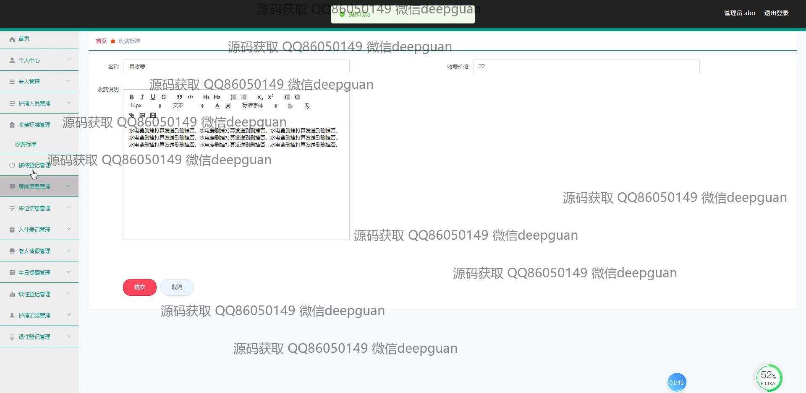
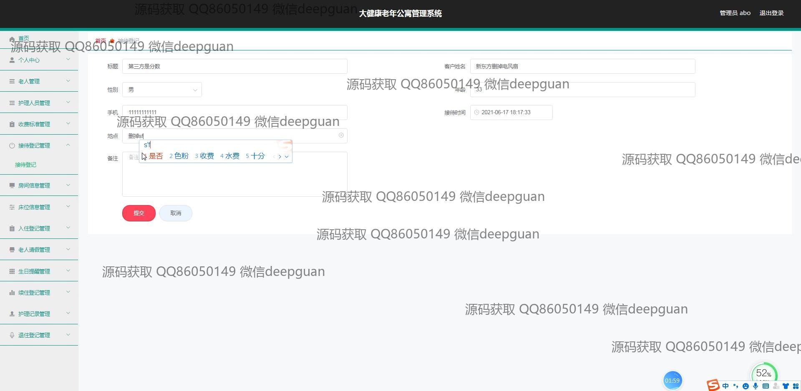
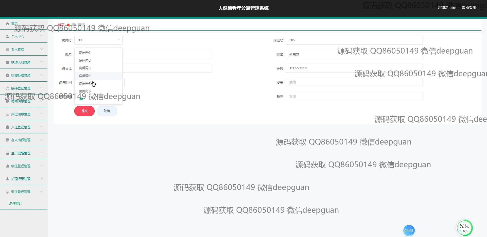

<h1 align="center">大健康老年公寓管理系统</h1>

## 简介
大健康老年公寓管理系统：角色分为管理员、用户；功能包括老人管理、房间信息管理、入住登记、护理记录、收费标准管理、请假管理、续住管理、退住管理等，支持信息录入与维护。    --计算机毕业设计源码；毕设源码；java毕业设计源码

## 联系方式

<h3 align="center">获取完整代码与数据库文件 + 微信：deepguan QQ: 86050149 QQ群: 783742310</h3>

<h3 align="center">可帮忙远程部署 包运行成功！提供远程部署、修改代码、设计文档指导、代码讲解等服务！</h3>

## 功能介绍（完整见运行截图）
管理员： 基本功能：用户登录、注册及密码修改 系统管理：老人、护理人员和房间信息的记录和管理 收费管理：老年公寓的收费标准设置与调整 信息录入：入住登记与退住管理、床位分配和续住记录维护 请假管理：老人请假信息的审核和管理 健康管理：护理记录和健康数据的维护与更新 个人中心：个人信息查看与账户设置  

老人： 个人信息管理：基本信息录入与修改 居住安排：选择房间和床位、请假申请与审批 费用信息：查看收费标准与缴费记录 健康记录：个人健康数据的查看与更新 院内活动：参与活动登记与查看记录 个人中心：信息查看与修改请求  

护理人员： 个人信息：基本信息查看与更新 护理管理：护理记录的创建与更新 老人协助：协助入住、退住和续住信息办理 健康数据：老人健康记录的输入与维护 任务执行：分配护理任务与完成报告 个人中心：个人信息与工作记录管理  

访客： 登记管理：访客信息登记与管理 系统查询：查看可用房间与服务信息 预约参观：预约院区参观与活动参与 信息咨询：获取系统相关信息与帮助指引 个人中心：访客个人信息的查看与编辑

## 运行截图

本代码来源于网络,仅供学习参考使用!

